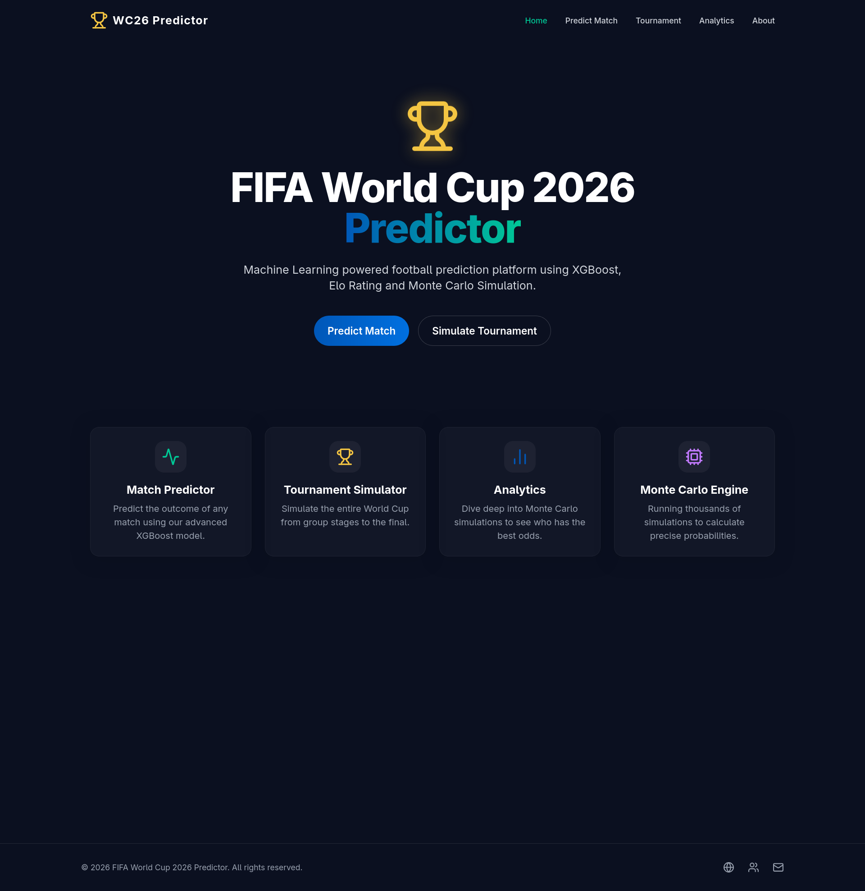
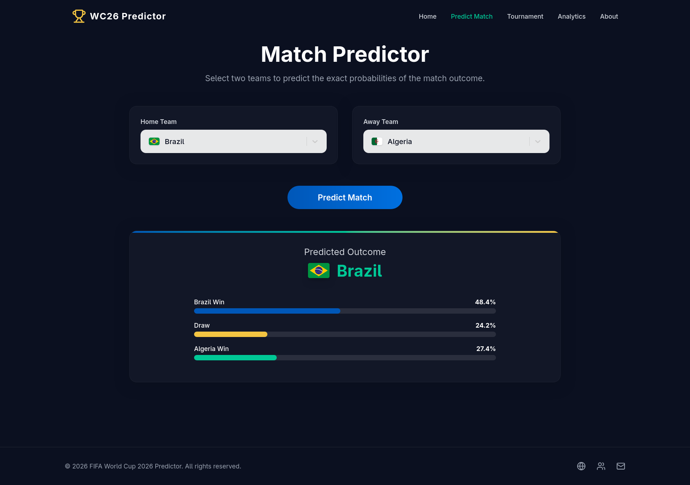
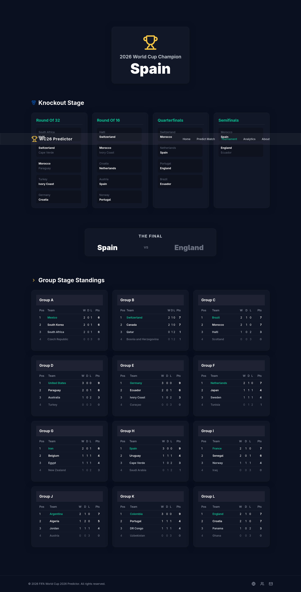
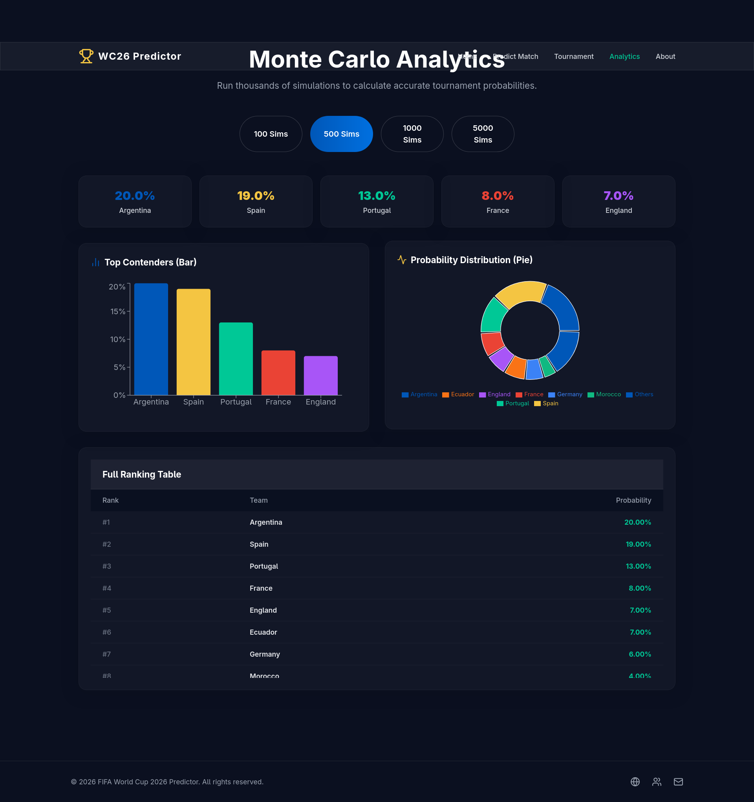

# ⚽ FIFA World Cup 2026 Predictor

A full-stack Machine Learning application that predicts international football match outcomes and simulates the complete **FIFA World Cup 2026** tournament using historical match data, Elo ratings, and Monte Carlo simulation.

---

## 🌍 Live Demo

**Frontend:** *(Add your deployed frontend URL)*

**Backend API:** *(Add your deployed FastAPI URL)*

**API Documentation:** *(Add `/docs` URL after deployment)*

---

# 📖 Overview

This project predicts football match outcomes using a Machine Learning model trained on historical international football matches.

It also simulates the complete FIFA World Cup 2026 tournament:

* Group Stage
* Qualification
* Round of 32
* Round of 16
* Quarterfinals
* Semifinals
* Final
* Champion

The application includes an interactive React frontend and a FastAPI backend.

---

# ✨ Features

### ⚽ Match Prediction

Predicts probabilities for:

* Home Win
* Draw
* Away Win

using an XGBoost model.

---

### 🏆 World Cup Simulator

Simulates the complete tournament including

* Group Stage
* Group Standings
* Qualification
* Knockout Stage
* Final
* Champion

---

### 📊 Monte Carlo Simulation

Run the tournament hundreds or thousands of times to estimate:

* Champion Probability
* Tournament Winners Distribution

---

### 📈 Team Strength Model

Every team is represented using:

* Elo Rating
* Win Rate
* Average Goals Scored
* Average Goals Conceded
* Home Advantage
* Tournament Type
* Recent Form

---

### 🌐 REST API

Built with FastAPI.

Interactive API documentation available using Swagger UI.

---

### 💻 Modern Frontend

Built using:

* React
* Vite
* Tailwind CSS
* Axios

Includes:

* Match Predictor
* Tournament Simulator
* Analytics Dashboard
* Responsive Design

---

# 🧠 Machine Learning Pipeline

Dataset

↓

Feature Engineering

↓

Elo Rating Calculation

↓

Model Training (XGBoost)

↓

Probability Prediction

↓

Tournament Simulation

↓

Monte Carlo Analysis

---

# 🛠 Tech Stack

## Frontend

* React
* Vite
* Tailwind CSS
* Axios
* Framer Motion
* Recharts

---

## Backend

* FastAPI
* Uvicorn

---

## Machine Learning

* XGBoost
* Scikit-learn
* Pandas
* NumPy

---

## Language

* Python
* JavaScript

---

# 📂 Project Structure

```text
worldcup_predictor/

│

├── backend/

│   ├── app.py

│   ├── football_model.py

│   ├── group_stage.py

│   ├── knockout_stage.py

│   ├── tournament_models.py

│   ├── worldcup_xgb.pkl

│   ├── team_stats.pkl

│   ├── features.pkl

│

├── frontend/

│   ├── React Application

│

├── data/

│   ├── results.csv

│   ├── draws.csv

│

└── README.md
```

---

# 🚀 API Endpoints

## GET /

Returns API status.

---

## POST /predict-match

Input

```json
{
    "home_team":"Brazil",
    "away_team":"France"
}
```

Response

```json
{
    "home_win":0.61,
    "draw":0.20,
    "away_win":0.19
}
```

---

## POST /simulate-match

Returns a simulated winner.

---

## GET /simulate-world-cup

Returns:

* Group Results
* Qualified Teams
* Knockout Stage
* Champion

---

## POST /champion-probabilities

Runs Monte Carlo simulations.

Input

```json
{
    "simulations":1000
}
```

Returns championship probabilities for all teams.

---

# 📊 Dataset

Historical international football matches from Kaggle.

The dataset was cleaned and filtered to focus on recent international football to better represent modern team strength.

Additional features were engineered using:

* Elo Ratings
* Win Rate
* Average Goals
* Goals Conceded
* Home Advantage
* Tournament Importance

---

# 📸 Screenshots

## Home Page



---

## Match Predictor



---

## Tournament Simulator



---

## Analytics Dashboard


---

# 🔮 Future Improvements

* Official FIFA 2026 Round of 32 bracket logic
* Score prediction
* Expected Goals (xG)
* Live FIFA rankings integration
* Injury and suspension modelling
* Dynamic Elo updates after each simulated match
* Cloud deployment with Docker

---

# 👨‍💻 Author

**Arunav Iyer**

Computer Engineering Student

Vellore Institute of Technology, Chennai

GitHub: *(Add GitHub Link)*

LinkedIn: *(Add LinkedIn Link)*

---

# ⭐ If you like this project

Please consider giving the repository a ⭐ on GitHub.
